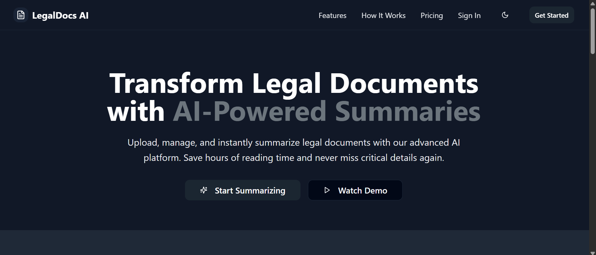

# 🧠 LegalDocs AI



**LegalDocs AI** is an AI-powered web assistant that extracts and summarizes complex legal documents (PDFs) in seconds. Built with a FastAPI backend and a modern React + Builder.io frontend, it delivers concise, accurate legal insights with source traceability.

---

## 🚀 Features

- 🔐 **User Authentication**: Secure login and signup.
- 📄 **PDF Upload**: Upload court cases or any legal documents.
- 🧠 **AI Summarization**: Fast, reliable legal summaries using NLP models.
- 📚 **Source Tracing**: Get page-specific references for every summary.
- 🗂 **Summary History**: Track all previously uploaded and summarized files.
- 🌐 **Builder.io UI**: Visually editable frontend using Builder components.

---

## 🛠 Tech Stack

| Layer         | Tools / Frameworks                                  |
|---------------|------------------------------------------------------|
| **Frontend**  | React, TypeScript, TailwindCSS, Vite, Builder.io     |
| **Backend**   | FastAPI, Python, LangChain, HuggingFace Transformers |
| **DevOps**    | GitHub, Netlify, Docker                              |

---

## 📁 Folder Structure

```bash
LegalDocs-AI/
├── backend/
│   ├── main.py
│   ├── summarizer.py
│   ├── model_pipeline.py
│   └── requirements.txt
│
├── client/
│   ├── App.tsx
│   ├── global.css
│   ├── components/
│   ├── hooks/
│   ├── lib/
│   └── pages/
│       ├── Dashboard.tsx
│       ├── Features.tsx
│       ├── HowItWorks.tsx
│       ├── Index.tsx
│       ├── Pricing.tsx
│       └── SignIn.tsx
│
├── public/
│   └── homepage.png
│
├── shared/
│   └── api.ts
│
│
├── .env
├── netlify.toml
├── tailwind.config.ts
├── README.md


🧪 How to Run Locally
1. 🚀 Backend (FastAPI)
cd backend
python -m venv venv
venv\Scripts\activate    # On Windows
pip install -r requirements.txt
uvicorn main:app --reload

2. 💻 Frontend (Vite + React)
cd client
npm install
npm run dev
Frontend: http://localhost:5173

Backend: http://127.0.0.1:8000


🌐 Deployment
This project is ready to be deployed on:

Netlify (Frontend)

Render, Heroku, or Docker (Backend)

See netlify/functions/api.ts for the Netlify Functions setup.


🧾 License & Credits
Built by @prakritea
Powered by OpenAI, LangChain & HuggingFace models.

✨ LegalDocs AI — Making legal documents readable in seconds.

---

### Now do this:

1. Save this as `README.md` in your root folder
2. Push it:

```bash
git add README.md public/homepage.png
git commit -m "Add clean README with banner and full project info"
git push origin main