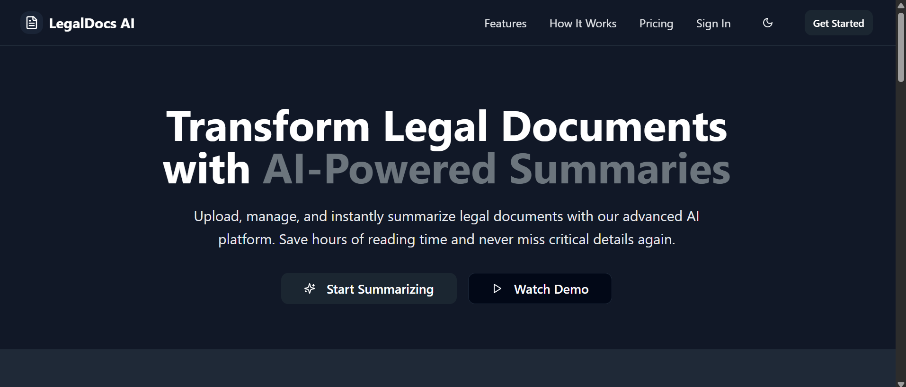

# LegalDocs AI



[](https://opensource.org/licenses/MIT)
[](https://www.typescriptlang.org/)
[](https://www.python.org/)
[](https://fastapi.tiangolo.com/)
[](https://reactjs.org/)

## Overview

LegalDocs AI is an automated document analysis system designed to streamline the processing of complex legal texts. Utilizing advanced Natural Language Processing (NLP) models, the platform facilitates the extraction of key insights, generation of concise summaries, and provision of verifiable source citations for legal contracts and court cases.

## Key Features

- **Automated Summarization**: Leverages large language models to process and summarize PDF documents with high accuracy.
- **Source Citation**: Implements precise page-level referencing to ensure traceability and verification of generated summaries.
- **Authentication & Security**: Features a secure user authentication system with robust session management.
- **Document Management**: Provides a persistent history of processed documents, allowing for efficient retrieval and review.
- **Responsive Interface**: Built on a modern React framework with TypeScript, ensuring a stable and type-safe user experience.

## Technical Architecture

### Backend

- **Framework**: FastAPI (Python) for high-performance API delivery.
- **NLP Engine**: LangChain integration with HuggingFace Transformers.
- **Persistence**: SQLAlchemy ORM with SQLite/PostgreSQL support.

### Frontend

- **Core**: React library with Vite build tool.
- **Language**: TypeScript for static typing and code maintainability.
- **Styling**: TailwindCSS for utility-first design.
- **Integration**: Builder.io for visual component management.

## Installation & Setup

### Prerequisites

- Python 3.9+
- Node.js 16+
- Git

### Backend Configuration

1.  Navigate to the backend directory:

    ```bash
    cd backend
    ```

2.  Initialize the Python virtual environment:

    ```bash
    python -m venv venv
    ```

3.  Activate the environment:

    - Windows: `.\venv\Scripts\activate`
    - macOS/Linux: `source venv/bin/activate`

4.  Install required dependencies:

    ```bash
    pip install -r requirements.txt
    ```

5.  Launch the application server:
    ```bash
    uvicorn main:app --reload
    ```
    The API will be accessible at `http://127.0.0.1:8000`.

### Frontend Configuration

1.  Navigate to the client directory:

    ```bash
    cd client
    ```

2.  Install package dependencies:

    ```bash
    npm install
    ```

3.  Start the development server:
    ```bash
    npm run dev
    ```
    The interface will be accessible at `http://localhost:5173`.

## Project Structure

```text
LegalDocs-AI/
├── backend/                # Application server and API logic
│   ├── core/               # Configuration and security settings
│   ├── models/             # Database schema definitions
│   ├── routers/            # API route handlers
│   ├── services/           # Business logic and AI processing
│   └── main.py             # Application entry point
│
├── client/                 # Frontend user interface
│   ├── src/
│   │   ├── components/     # React presentation components
│   │   ├── pages/          # Route views
│   │   ├── hooks/          # Custom state logic
│   │   └── lib/            # Utility functions
│   └── public/             # Static assets
│
└── shared/                 # Shared resources
```

## License

This project is licensed under the MIT License.
